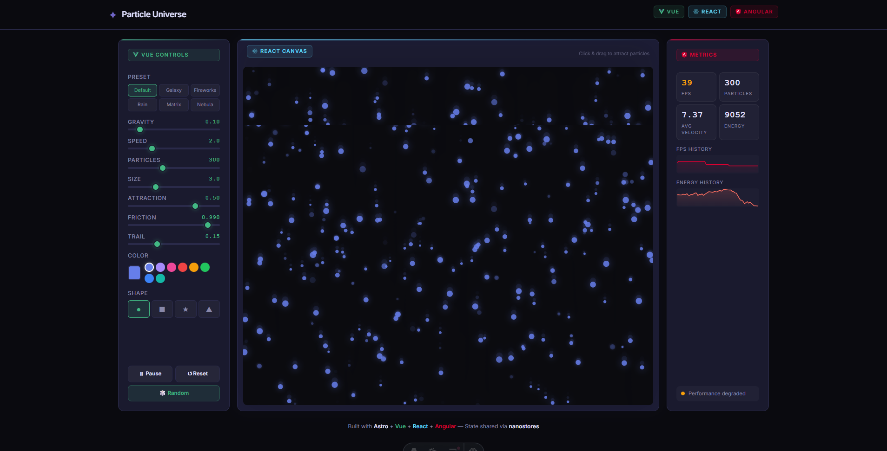

# Particle Universe

An interactive particle simulation dashboard where **Vue**, **React**, **Angular** and **Astro** work together in a single app, sharing state through **nanostores**.



## What it does

- **Vue** controls the sliders, presets, colors, and shapes
- **React** renders the particle canvas animation
- **Astro** displays live metrics with sparkline charts
- All three share the same state in real time

Click and drag on the canvas to attract particles. Try the presets (galaxy, fireworks, rain, matrix, nebula) or hit Random.

## Getting started

```sh
npm install
npm run dev
```

Open [localhost:4321](http://localhost:4321) and start playing.

## Built with

[Astro](https://astro.build/) | [Vue 3](https://vuejs.org/) | [React 19](https://react.dev/) | [Angular 21](https://angular.dev/) | [Tailwind 4](https://tailwindcss.com/) | [Nano Stores](https://github.com/nanostores/nanostores)
